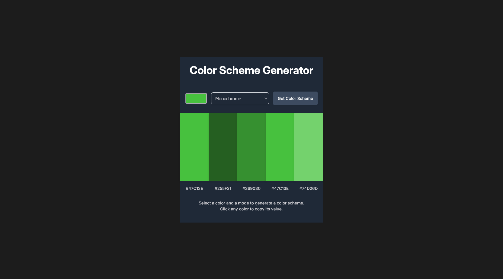

# Color Scheme Generator

A simple web app to generate beautiful color schemes based on a selected color and mode.  
You can pick a color, choose a scheme type (like monochrome, analogic, complement, triad, quad, etc.), and instantly see a palette of matching colors.  
Click any color to copy its hex value to your clipboard.

## Features

- Pick any base color using a color picker.
- Choose from multiple color scheme modes.
- Instantly view a palette of matching colors.
- Click a color to copy its hex code.
- Responsive and dark mode friendly.

## Screenshot



## Getting Started

To run this project locally:

```bash
# Clone the repository
git clone https://github.com/Achigyus/color-scheme-generator.git

# Navigate into the project directory
cd color-scheme-generator

# Install dependencies
npm install

# Start the development server
npm run dev
```

Then open [http://localhost:5173](http://localhost:5173) (or the port shown in your terminal) in your browser.

## Usage

1. Open the site in your browser.
2. Select a color and a mode.
3. Click "Get Color Scheme" or let it update automatically.
4. Click any color to copy its hex value.

---

Powered by [The Color API](https://www.thecolorapi.com/).